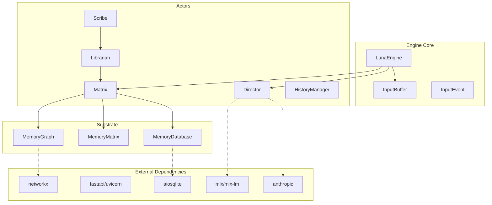

# Luna Engine v2.0 Dependency Graph

**Audit Date:** January 25, 2026
**Auditor:** Phase 1 Dependency Agent
**Scope:** Complete dependency analysis with circular import detection

---

## Executive Summary

**Result: NO CIRCULAR IMPORTS DETECTED**

The Luna Engine v2.0 architecture demonstrates clean separation of concerns through an actor-based message-driven system. The dependency graph is:
- **Acyclic**: No circular imports detected
- **Layered**: Clear tiers from engine → actors → substrate
- **Flexible**: Multiple fallback paths for resilience
- **Scalable**: Designed for incremental feature addition

---

## External Dependencies

### Core Dependencies (Always Required)

| Package | Version | Used By | Purpose |
|---------|---------|---------|---------|
| `anthropic` | >=0.18.0 | director.py | Claude API calls |
| `fastapi` | >=0.109.0 | api/server.py | HTTP server framework |
| `uvicorn` | >=0.27.0 | api/server.py | ASGI server |
| `pydantic` | >=2.5.0 | api/server.py | Request/response validation |
| `httpx` | >=0.26.0 | anthropic | HTTP client (dep) |
| `aiosqlite` | >=0.19.0 | substrate/database.py | Async SQLite |
| `networkx` | >=3.2 | substrate/graph.py | Graph algorithms |
| `pyyaml` | >=6.0 | consciousness/state.py, cli | YAML parsing |
| `rich` | >=13.0.0 | cli/console.py | Terminal formatting |
| `prompt-toolkit` | >=3.0.0 | cli/console.py | Interactive REPL |

### Optional Dependencies

| Package | Version | Used By | Purpose |
|---------|---------|---------|---------|
| `sqlite-vec` | >=0.1.0 | substrate/embeddings.py | Vector search |
| `mlx` | >=0.5.0 | inference/local.py | Apple Silicon ML |
| `mlx-lm` | >=0.0.10 | inference/local.py | LM inference |
| `numpy` | >=1.26.0 | inference/local.py | Numerical operations |
| `tiktoken` | N/A | core/context.py | Token counting |

---

## Architecture Layers

### Tier 1 - Engine Core
- `engine.py` - Main orchestrator (15 internal imports)
- Manages input buffer, event dispatch, actor lifecycle
- Coordinates cognitive/reflective loops

### Tier 2 - Actor System
- `actors/base.py` - Message-based actor pattern
- `actors/director.py` - LLM inference with routing (8 internal imports)
- `actors/matrix.py` - Memory substrate (3 internal imports)
- `actors/scribe.py` - Extraction pipeline
- `actors/librarian.py` - Memory filing
- `actors/history_manager.py` - Conversation tiers

### Tier 3 - Memory Substrate
- `substrate/database.py` - SQLite via aiosqlite
- `substrate/memory.py` - MemoryMatrix CRUD
- `substrate/graph.py` - NetworkX relationship graph
- `substrate/embeddings.py` - sqlite-vec integration
- `substrate/lock_in.py` - Memory persistence scoring

### Tier 4 - Context & Consciousness
- `core/context.py` - RevolvingContext (4 concentric rings)
- `consciousness/state.py` - ConsciousnessState
- `consciousness/attention.py` - Attention decay curves
- `consciousness/personality.py` - Trait modulation
- `context/pipeline.py` - Unified context pipeline
- `memory/ring.py` - ConversationRing buffer

### Tier 5 - Agentic Architecture
- `agentic/loop.py` - Agent observe→think→act cycle
- `agentic/planner.py` - Goal decomposition
- `agentic/router.py` - Complexity-based routing

### Tier 6 - Inference
- `inference/local.py` - LocalInference (Qwen 3B via MLX)
- Falls back to Claude delegation

### Tier 7 - Interface
- `api/server.py` - FastAPI endpoints (12 external deps)
- `cli/console.py` - Interactive CLI (9 external deps)

---

## Import Dependency Chain

```
LunaEngine (engine.py)
├── core/input_buffer.py → core/events.py
├── core/state.py
├── core/context.py
├── actors/base.py
├── actors/director.py
│   ├── anthropic
│   ├── inference/local.py → mlx, mlx-lm
│   ├── memory/ring.py
│   ├── context/pipeline.py
│   └── entities/context.py
├── actors/matrix.py
│   ├── substrate/database.py → aiosqlite
│   ├── substrate/memory.py
│   └── substrate/graph.py → networkx
├── actors/scribe.py
│   ├── extraction/types.py
│   └── extraction/chunker.py
├── actors/librarian.py
│   └── entities/resolution.py
├── actors/history_manager.py
├── consciousness/state.py → pyyaml
├── agentic/loop.py
│   ├── agentic/router.py
│   └── agentic/planner.py
└── tools/registry.py
    ├── tools/file_tools.py
    └── tools/memory_tools.py
```

---

## Critical Dependencies & Fallbacks

| Component | Primary | Fallback | Risk |
|-----------|---------|----------|------|
| Local Inference | MLX | Claude Delegation | mlx not installed |
| Memory Search | sqlite-vec | LIKE queries | semantic search unavailable |
| Context Pipeline | Unified system | ConversationRing | Phase 3 feature incomplete |
| Entity Context | EntityContext | Basic identity | no entity detection |
| Token Counting | tiktoken | len/4 approximation | inaccurate budgets |
| Conversation History | HistoryManager | Direct storage | no tiering |

---

## Circular Dependency Analysis

### Verified Safe Chains
- ✅ engine → actors → substrate → database (acyclic)
- ✅ director → context_pipeline → ring (acyclic)
- ✅ scribe → librarian → matrix (acyclic)

### Safety Mechanisms
1. **TYPE_CHECKING guards** - Type hints don't import at runtime
2. **Lazy initialization** - Components loaded on-demand
3. **Message passing** - Loose coupling between components
4. **Parameter injection** - `engine` parameter breaks potential cycles

Example safe pattern:
```python
# In actor/director.py
if TYPE_CHECKING:
    from luna.engine import LunaEngine

class DirectorActor(Actor):
    def __init__(self, name: str = "director", engine: Optional["LunaEngine"] = None):
        self.engine = engine  # Set after instantiation
```

---

## Message Flow Pipeline

### User Input → Response
```
User Input
    ↓
InputBuffer.put(event)
    ↓
Engine._cognitive_tick()
    ↓
Engine._dispatch_event(InputEvent)
    ↓
Engine._handle_user_message(text)
    ↓
QueryRouter.analyze(message)  [Decision: DIRECT or AGENTIC]
    ↓
    ├─→ DIRECT: LocalInference or Claude
    └─→ AGENTIC: AgentLoop → Planner → Director
    ↓
User receives response
```

### Response → Memory Storage
```
DirectorActor generates response
    ↓
Engine._handle_actor_message(generation_complete)
    ↓
Engine.record_conversation_turn()
    ↓
    ├─→ _trigger_extraction() → ScribeActor
    │       ↓
    │   SemanticChunker.chunk(text)
    │       ↓
    │   LibrarianActor.file_entities()
    │       ↓
    │   MatrixActor.store() → MemoryDatabase
    │
    ├─→ HistoryManagerActor.add_turn()
    │
    └─→ MatrixActor.store_turn()
```

---

## Dependency Mermaid Diagram



---

## Recommendations

### Performance Monitoring
- Director complexity growth (currently ~1900 lines)
- Engine tick latency (target: <50ms cognitive, <5min reflective)
- Memory query latency (target: <200ms)
- Context assembly time (target: <50ms)

### Future Scaling
- sqlite-vec required for >50k nodes
- Horizontal sharding for >1M nodes
- Consider splitting DirectorActor responsibilities

---

**End of Dependency Graph**
