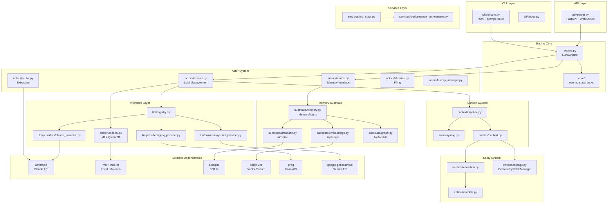

# Luna Engine v2.0 Dependency Audit

**Phase 1: Luna Engine Bible v3.0 Audit**
**Agent:** Dependency Mapper
**Date:** 2026-01-30

---

## 1. Import Graph Summary

The Luna Engine codebase (`src/luna/`) contains **85+ Python modules** organized across **18 sub-packages**:

### Package Structure
```
src/luna/
├── __init__.py          # Root exports
├── engine.py            # Main LunaEngine class
├── actors/              # Actor pattern implementation (5 modules)
├── agentic/             # Agent loop, planner, router (4 modules)
├── api/                 # FastAPI server (2 modules)
├── cli/                 # CLI interface (3 modules)
├── consciousness/       # Attention, personality, state (4 modules)
├── context/             # Context pipeline (2 modules)
├── core/                # Events, input buffer, state, tasks (8 modules)
├── diagnostics/         # Health checks, watchdog (4 modules)
├── entities/            # Entity system, resolution, lifecycle (8 modules)
├── extraction/          # Chunker, types (3 modules)
├── identity/            # Identity management (1 module)
├── inference/           # Local MLX inference (2 modules)
├── librarian/           # Cluster retrieval (2 modules)
├── llm/                 # Multi-provider LLM system (7 modules)
├── memory/              # Ring buffer, clustering, constellation (6 modules)
├── services/            # Orb state, performance (4 modules)
├── substrate/           # Database, embeddings, graph, memory (6 modules)
├── tools/               # Tool registry, file/memory tools (4 modules)
└── tuning/              # Voice tuning parameters (3 modules)
```

---

## 2. Circular Import Risk Analysis

### Potential Circular Import Chains Detected

| Risk Level | Import Chain | Mitigation |
|------------|--------------|------------|
| **HIGH** | `engine.py` -> `actors/director.py` -> `inference/local.py` -> (engine stats) | Uses TYPE_CHECKING guards |
| **MEDIUM** | `entities/context.py` -> `entities/resolution.py` -> `entities/models.py` | Uses TYPE_CHECKING guards |
| **MEDIUM** | `context/pipeline.py` -> `entities/resolution.py` -> `substrate/database.py` | Uses TYPE_CHECKING guards |
| **LOW** | `llm/registry.py` -> `llm/config.py` -> `llm/registry.py` (get_config) | Config is stateless singleton |
| **LOW** | `services/performance_orchestrator.py` -> `services/orb_state.py` | Direct import, no cycle |

### Mitigation Patterns Used
1. **TYPE_CHECKING guards** - Used extensively in `entities/`, `context/`, and `actors/` modules
2. **Lazy imports** - Used in `llm/providers/`, `inference/local.py` for optional deps
3. **Dependency injection** - Database passed as parameter, not imported

---

## 3. Optional Dependency Fallbacks (try/except Patterns)

### Critical Optional Dependencies

| Module | Import | Fallback Behavior | Risk |
|--------|--------|-------------------|------|
| **inference/local.py** | `mlx.core`, `mlx_lm` | Sets `MLX_AVAILABLE = False`, disables local inference | Low - graceful degradation |
| **substrate/embeddings.py** | `sqlite_vec` | Sets `_vec_loaded = False`, uses keyword search fallback | Low - documented fallback |
| **substrate/local_embeddings.py** | `sentence_transformers` | Raises RuntimeError on use | Medium - hard fail if called |
| **actors/director.py** | `luna.llm` | Sets `LLM_REGISTRY_AVAILABLE = False` | Low - uses default provider |
| **actors/director.py** | `luna.entities.context` | Sets `ENTITY_CONTEXT_AVAILABLE = False` | Low - skips entity injection |
| **actors/director.py** | `luna.context.pipeline` | Sets `CONTEXT_PIPELINE_AVAILABLE = False` | Low - uses legacy context |
| **actors/scribe.py** | `anthropic` | Lazy init, fails on first use | Medium - API call fails |
| **core/context.py** | `tiktoken` | Uses `len(text) // 4` approximation | Low - acceptable accuracy |
| **llm/providers/groq_provider.py** | `groq` | Logs warning, returns None client | Low - graceful |
| **llm/providers/gemini_provider.py** | `google.generativeai` | Logs warning, returns None | Low - graceful |
| **llm/providers/claude_provider.py** | `anthropic` | Logs warning, returns None | Low - graceful |
| **entities/context.py** | `entities/models` (EmergentPrompt, etc.) | Sets `PERSONALITY_MODELS_AVAILABLE = False` | Low - skips emergent prompt |
| **consciousness/state.py** | `yaml` | Fails on save/load of state | Medium - persistence fails |

### Fallback Pattern Quality Assessment

**Good patterns:**
- `MLX_AVAILABLE` boolean flag with graceful degradation
- `_vec_loaded` flag with keyword search fallback
- Lazy client initialization in LLM providers

**Needs improvement:**
- `sentence_transformers` import raises RuntimeError rather than graceful degradation
- `anthropic` in scribe.py fails silently until first use

---

## 4. External Package Versions (pyproject.toml)

### Core Dependencies (Required)

| Package | Version Constraint | Purpose | Actual Usage |
|---------|-------------------|---------|--------------|
| fastapi | `>=0.109.0` | HTTP API server | `api/server.py` |
| uvicorn | `>=0.27.0` | ASGI server | `api/server.py` |
| pydantic | `>=2.5.0` | Data validation | `api/server.py`, models |
| anthropic | `>=0.18.0` | Claude API client | `actors/director.py`, `actors/scribe.py`, `llm/providers/claude_provider.py` |
| httpx | `>=0.26.0` | HTTP client | `actors/director.py` (streaming) |
| pyyaml | `>=6.0` | YAML config parsing | `consciousness/state.py`, config loading |
| aiosqlite | `>=0.19.0` | Async SQLite | `substrate/database.py` |
| networkx | `>=3.2` | Graph operations | `substrate/graph.py` |
| rich | `>=13.0.0` | Terminal formatting | `cli/console.py`, `cli/debug.py` |
| prompt-toolkit | `>=3.0.0` | CLI input handling | `cli/console.py` |

### Optional Dependencies

#### [memory] - Vector embeddings
| Package | Version Constraint | Purpose | Used In |
|---------|-------------------|---------|---------|
| sqlite-vec | `>=0.1.0` | Vector similarity search | `substrate/embeddings.py` |
| networkx | `>=3.2` | (duplicate of core) | - |
| numpy | `>=1.26.0` | Numerical operations | `substrate/local_embeddings.py` |

#### [local] - MLX local inference
| Package | Version Constraint | Purpose | Used In |
|---------|-------------------|---------|---------|
| mlx | `>=0.5.0` | Apple Silicon ML | `inference/local.py` |
| mlx-lm | `>=0.0.10` | Language model inference | `inference/local.py` |

#### [mcp] - MCP protocol
| Package | Version Constraint | Purpose | Used In |
|---------|-------------------|---------|---------|
| mcp | `>=1.0.0` | MCP protocol | `src/luna_mcp/` |
| httpx | `>=0.26.0` | (duplicate) | - |
| fastapi | `>=0.109.0` | (duplicate) | - |
| uvicorn | `>=0.27.0` | (duplicate) | - |

#### [dev] - Development tools
| Package | Version Constraint | Purpose |
|---------|-------------------|---------|
| pytest | `>=7.4.0` | Testing |
| pytest-asyncio | `>=0.23.0` | Async test support |
| ruff | `>=0.1.0` | Linting |

---

## 5. Declared vs Actual Usage Comparison

### Declared Dependencies Actually Used

| Package | Declared | Actually Imported | Status |
|---------|----------|-------------------|--------|
| fastapi | Yes | Yes - `api/server.py` | VERIFIED |
| uvicorn | Yes | Yes - `api/server.py` | VERIFIED |
| pydantic | Yes | Yes - `api/server.py`, models | VERIFIED |
| anthropic | Yes | Yes - multiple modules | VERIFIED |
| httpx | Yes | Yes - `actors/director.py` | VERIFIED |
| pyyaml | Yes | Yes - `consciousness/state.py` | VERIFIED |
| aiosqlite | Yes | Yes - `substrate/database.py` | VERIFIED |
| networkx | Yes | Yes - `substrate/graph.py` | VERIFIED |
| rich | Yes | Yes - `cli/console.py`, `cli/debug.py` | VERIFIED |
| prompt-toolkit | Yes | Yes - `cli/console.py` | VERIFIED |

### Undeclared Dependencies (Used but not in pyproject.toml)

| Package | Used In | Type | Recommendation |
|---------|---------|------|----------------|
| `groq` | `llm/providers/groq_provider.py` | Optional (try/except) | Add to optional `[llm]` group |
| `google-generativeai` | `llm/providers/gemini_provider.py` | Optional (try/except) | Add to optional `[llm]` group |
| `openai` | `substrate/embeddings.py` (EmbeddingGenerator) | Optional (lazy init) | Add to optional `[embeddings]` group |
| `sentence-transformers` | `substrate/local_embeddings.py` | Optional (lazy load) | Add to optional `[memory]` group |
| `tiktoken` | `core/context.py` | Optional (try/except) | Add to optional `[utils]` group |

---

## 6. Unused Dependencies

### Analysis Method
Compared declared dependencies against actual import statements in all Python files.

### Results

| Package | Status | Notes |
|---------|--------|-------|
| All core deps | USED | No unused core dependencies found |
| numpy (in [memory]) | PARTIALLY USED | Only in `local_embeddings.py` (sentence-transformers returns numpy arrays) |

**Conclusion:** No truly unused dependencies found. All declared packages are imported somewhere in the codebase.

---

## 7. Architecture Layer Diagram



---

## 8. Recommendations

### HIGH Priority

1. **Add undeclared optional dependencies to pyproject.toml:**
   ```toml
   [project.optional-dependencies]
   llm = [
       "groq>=0.4.0",
       "google-generativeai>=0.3.0",
   ]
   embeddings = [
       "openai>=1.0.0",  # For OpenAI embeddings
       "sentence-transformers>=2.2.0",  # For local embeddings
   ]
   utils = [
       "tiktoken>=0.5.0",  # Token counting
   ]
   ```

2. **Improve sentence-transformers fallback:** Change from RuntimeError to graceful degradation with a warning.

### MEDIUM Priority

3. **Document the dependency matrix:** Add a DEPENDENCIES.md explaining which optional deps enable which features.

4. **Add version pinning for production:** Consider using exact versions or narrow ranges for stability.

5. **Create a dependency health check:** Add a diagnostic that reports which optional deps are available.

### LOW Priority

6. **Remove duplicate declarations:** `networkx`, `httpx`, `fastapi`, `uvicorn` appear in multiple optional groups.

7. **Consider lazy loading more dependencies:** Especially for the LLM providers to speed up import time.

---

## 9. Dependency Health Summary

| Category | Status | Details |
|----------|--------|---------|
| **Core Dependencies** | HEALTHY | All declared deps are used and imported correctly |
| **Optional Dependencies** | NEEDS ATTENTION | 5 packages used but not declared in pyproject.toml |
| **Circular Imports** | MITIGATED | TYPE_CHECKING guards used effectively |
| **Fallback Patterns** | GOOD | Most optional imports have graceful fallbacks |
| **Version Constraints** | ADEQUATE | Minimum versions specified, could be tighter |

**Overall Assessment:** The dependency structure is well-organized with good use of TYPE_CHECKING guards and optional import patterns. Main action items are declaring the undeclared optional dependencies and improving one fallback pattern.

---

*Generated by Dependency Mapper Agent - Luna Engine Bible v3.0 Audit Phase 1*
